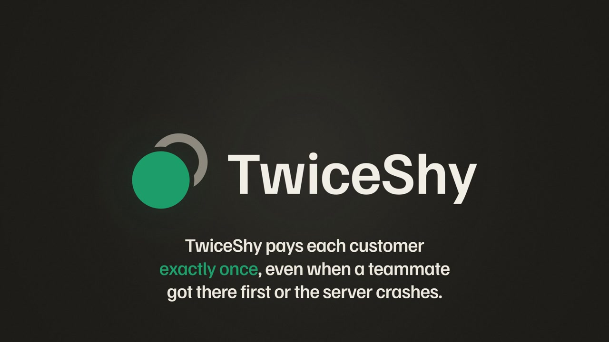
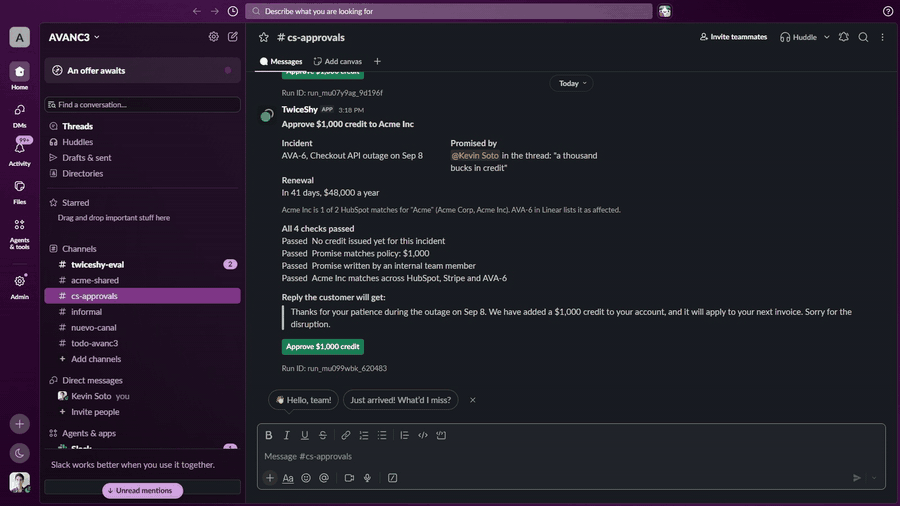
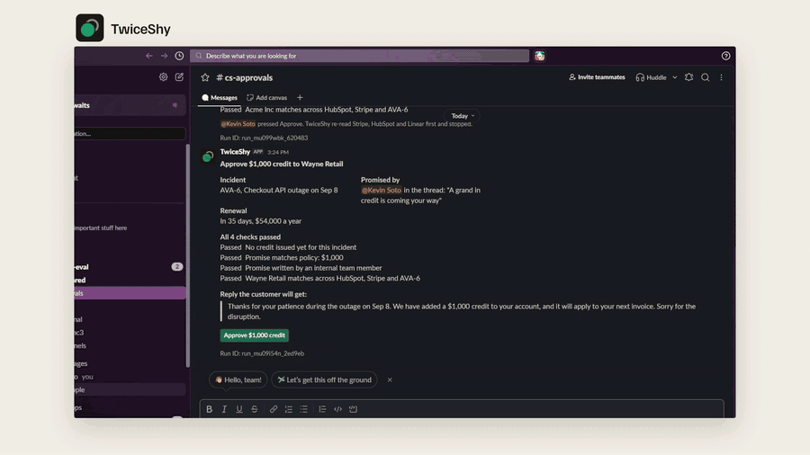
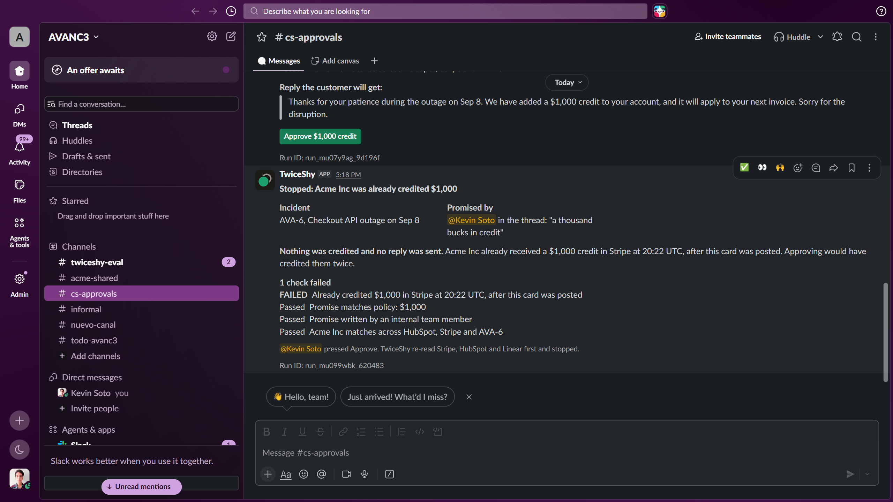
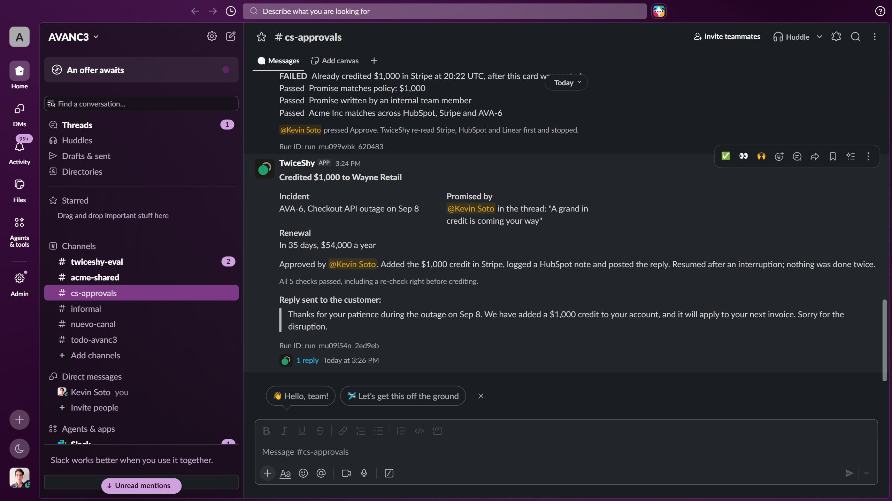
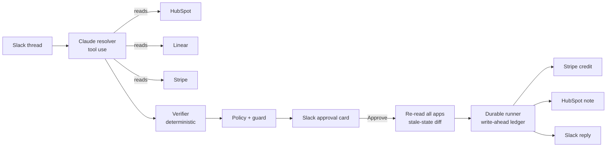
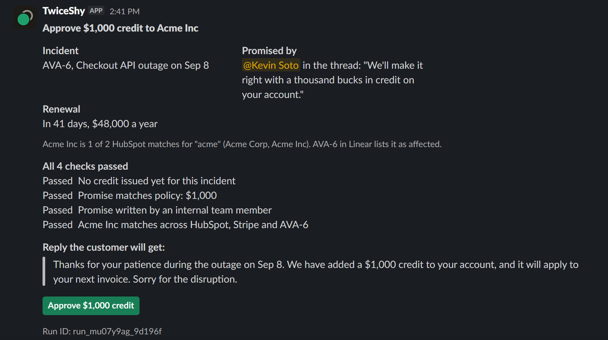

<p align="center">
  <picture>
    <source media="(prefers-color-scheme: dark)" srcset="docs/brand/twiceshy-lockup-dark.png">
    <source media="(prefers-color-scheme: light)" srcset="docs/brand/twiceshy-lockup-light.png">
    
  </picture>
</p>

<h3 align="center">TwiceShy pays each customer exactly once, even when a teammate got there first or the server crashes.</h3>

<p align="center">For customer success teams that promise SLA credits in Slack after an outage, and settle them by hand in HubSpot, Linear and Stripe.</p>

<p align="center">
  &nbsp;&nbsp;&nbsp;&nbsp;
  &nbsp;&nbsp;&nbsp;&nbsp;
  &nbsp;&nbsp;&nbsp;&nbsp;
  &nbsp;&nbsp;&nbsp;&nbsp;
  
  <br><sub>Slack, HubSpot, Linear and Stripe, orchestrated by one Claude agent</sub>
</p>

<p align="center">
  <a href="https://youtu.be/NWAxSzs71Pc"></a>
</p>

<p align="center">
  <a href="https://youtu.be/NWAxSzs71Pc"><b>Watch the 2-minute demo</b></a>
  &nbsp;·&nbsp;
  <a href="BRIEF.md"><b>Read the one-page system and reliability brief</b></a>
  &nbsp;·&nbsp;
  <a href="#how-to-run"><b>Run it offline in one command</b></a>
</p>

<p align="center">
  <a href="https://github.com/kasbsquall/twiceshy/actions/workflows/ci.yml"></a>
</p>

# TwiceShy

**For judges, in 30 seconds**

| What you need | Where |
|---|---|
| Two-minute demo video | [YouTube](https://youtu.be/NWAxSzs71Pc) |
| System and reliability brief | [BRIEF.md](BRIEF.md) (one page), full detail below |
| Live eval results at the submitted code | [eval/results/2026-09-13T19-33-04-265Z/results.md](eval/results/2026-09-13T19-33-04-265Z/results.md) |
| Live Slack session: a blocked approval and a real crash and resume | [docs/evidence/2026-09-13-live-slack-session](docs/evidence/2026-09-13-live-slack-session/README.md) |
| Try it with no keys | `npm ci && npm run demo:offline -- --scenario s7-crash` |
| Run it on a thread you write (live keys) | `npm run resolve -- --channel <id> --ts <thread_ts>`. Our eval threads were written by us, see [Limitations](#limitations). |

<table>
  <tr>
    <td width="50%"></td>
    <td width="50%"></td>
  </tr>
  <tr>
    <td><b>A teammate got there first.</b> Approve in real Slack, TwiceShy re-reads Stripe and stops: nothing credited, no reply sent.</td>
    <td><b>The server crashes after Stripe took the money.</b> On restart it finds the credit by run ID and finishes the note and reply once.</td>
  </tr>
</table>

"Exactly once" here means one credit, one CRM note and one customer reply per case, across teammates and restarts. The narrow limits (a credit made in the milliseconds between the final re-read and the Stripe call, and false blocks on unrelated manual credits) are in [Limitations](#limitations).

**At a glance** (live apps, Stripe test mode, full numbers and caveats in [How we tested reliability](#how-we-tested-reliability)):

| 33 live runs per flow | TwiceShy | Same flow without TwiceShy |
|---|---|---|
| Runs that credited the wrong account, more than owed, or twice | 0 of 33 | 12 of 33 |
| Dollars over-credited | $0 | $9,750 |
| Scenarios that depend on Claude reading the thread (s1, s2, s3, s8, s9, s10, s11): correct outcome | 21 of 21 | 6 of 21 |
| Scenarios decided mostly by code: earlier credits, the teammate race, the crash (s4, s5, s6, s7): correct outcome | 12 of 12 | 4 of 12 |

The comparison flow cannot hold or block a case, so it loses those scenarios by construction; the table in the reliability section separates that from money it actually credited wrongly.

 

## What we built

After an outage, customer success teams promise SLA credits in shared Slack threads. The thread says "Acme", "the Tuesday outage", "a thousand bucks". Someone then has to find the right account in the CRM, the right incident, the amount the contract allows, credit it in Stripe, log it, and reply to the customer. When two people handle the same thread, or a script dies halfway, the customer gets paid twice or hears the same apology twice.

TwiceShy is one orchestrator agent that settles the credit:

1. **Claude resolves the thread** with tools across four apps: which HubSpot company (there are two Acmes), which Linear incident (by the time the customer describes), and which promise is in force (amounts in words, promises corrected later, promises nobody on the team made).
2. **Code checks what Claude submits.** Every ID must exist in its app, HubSpot must link the company to that Stripe customer, the incident must list the company as affected, and the quoted promise must appear verbatim in the stated message by the stated author.
3. **Policy decides the money.** SLA tier from HubSpot times severity from Linear gives the credit. Role caps apply to promises.
4. **A guard returns PASS, HOLD or BLOCK** with reasons written for a CS manager: four checks before the card is posted, and a fifth on Approve.
5. **A human approves in Slack.** Only listed approvers can press Approve, and by default never the person who made the promise (our demo workspace has one person, so the demo and eval turn that off with `ALLOW_SELF_APPROVAL=true`; the card you see shows the same account promising and approving). On Approve, TwiceShy re-reads Stripe, HubSpot and Linear and stops if anything changed since the card was posted.
6. **A crash-safe runner executes** the Stripe credit, the HubSpot note and the Slack reply once each, across process restarts.

A CS lead runs it on a thread once the customer asks for compensation (`npm run resolve`). A PASS card waits for one click. A HOLD card says why and who should confirm; after the thread is corrected, running TwiceShy on it again posts a new card. A BLOCK card says what already happened in Stripe, so nobody pays twice.

### Why this matters

Each piece of this problem is documented in public, even if nobody we could find has written up the exact Slack-thread case:

- **SLA credits are handled by hand.** AWS says "you must submit a claim by opening a case in the AWS Support Center" ([Amazon Compute SLA](https://aws.amazon.com/compute/sla/)), and Azure customers ask how to claim one at all ([Microsoft Q&A](https://learn.microsoft.com/en-us/answers/questions/5603494/how-to-request-a-sla-credit-in-azure)).
- **Money goes out twice when two channels act on the same debt.** A merchant refunded a customer whose bank had already processed a chargeback: "we paid the money twice." ([Shopify Community](https://community.shopify.com/t/how-can-i-recover-a-double-refunded-payment/236141), anecdotal). Support teams ask for help because "two of our support agents instantly reply" ([Zendesk Community](https://community.zendesk.com/fid-8/tid-15923), anecdotal); Zendesk's collision warning only covers its own ticket view, not a Slack thread plus the Stripe dashboard.
- **A crash leaves you not knowing whether the money moved.** Stripe: clients "don't know whether or not the server received the request" after a network failure, and idempotency keys expire after 24 hours ([Stripe docs](https://docs.stripe.com/error-low-level)). Duplicate payouts also happen at scale for other reasons: Santander said about 75,000 payments were "incorrectly duplicated" after a scheduling issue ([NBC News](https://www.nbcnews.com/business/business-news/bank-accidentally-deposits-176-million-peoples-accounts-christmas-day-rcna10538)).
- **AI agents with real side effects need a human gate.** OWASP asks to "require a human to approve high-impact actions before they are taken" ([LLM06:2025 Excessive Agency](https://genai.owasp.org/llmrisk/llm062025-excessive-agency/)). And promises cost money: in Moffatt v. Air Canada the airline was held to a refund its chatbot promised ([McCarthy Tetrault](https://www.mccarthy.ca/en/insights/blogs/techlex/moffatt-v-air-canada-misrepresentation-ai-chatbot)). TwiceShy's authority check is about promises people make in a thread, which is a related risk, not the same one.

**Closest existing tools, and what they do not cover.**

| Tool | What it prevents | What it cannot see |
|---|---|---|
| Stripe idempotency keys ([docs](https://docs.stripe.com/error-low-level)) | The same API request creating two charges or credits, for 24 hours | A credit a teammate made by hand in the dashboard; a reply or CRM note sent twice; a retry after the key expired |
| Zendesk agent collision ([docs](https://support.zendesk.com/hc/en-us/articles/9186264597146-Avoiding-agent-collision)) | Two agents replying to the same ticket at once | Anything outside the ticket view: a Slack thread, the Stripe dashboard |
| Human approval for agent actions ([OWASP LLM06](https://genai.owasp.org/llmrisk/llm062025-excessive-agency/)) | An agent acting without a person saying yes | Whether the world changed between the approval request and the click, and whether the promise came from someone allowed to make it |

**Who runs it, and when.** A CS lead, after an incident, on each customer thread that asks for compensation. We have not measured how often this happens in a real team.

**What is new here.** Stripe's idempotency key protects one API request for 24 hours, and our own baseline shows it works: 0 duplicate Stripe credits. It cannot see a credit a teammate made by hand in the dashboard, a promise from someone not allowed to make it, or a reply that was never sent because the process died after paying. TwiceShy guards the agent's side effects across people, apps and restarts, with a human approving and code, not the model, deciding the money.

Sources and verbatim quotes, with dates: [docs/research-usefulness.md](docs/research-usefulness.md).

### Architecture



### What Claude decides and what code decides

| Claude (src/agent/resolve.ts) | Code |
|---|---|
| Which company a loose name refers to | That the company, incident and Stripe customer exist, and HubSpot links the company to that Stripe customer (src/agent/verifyProposal.ts, src/guard/checks.ts) |
| Which incident "Tuesday afternoon" means | That the incident lists the company as affected |
| Which promise is in force and its amount in dollars | That the quote appears verbatim in that message, written by that user, and that the user's role allows it |
| When a thread is ambiguous, the candidates and a question | The credit amount (src/policy.ts), every PASS, HOLD and BLOCK, and all writes |

The card never shows model prose. Every line on it is built from records read back from the apps and from HubSpot searches that code re-runs. The reply to the customer is a fixed template.

### Guard

| Check | Reason code | Verdict | When |
|---|---|---|---|
| Duplicate credit | `DUPLICATE_CREDIT` | BLOCK | A credit for this incident exists by metadata, or a credit without metadata was created after the incident started (how a person crediting in the dashboard looks) |
| Amount vs policy | `AMOUNT_VS_POLICY`, `AMOUNT_ABOVE_ROLE_CAP` | HOLD | An internal promise differs from the policy amount or exceeds the author's role cap |
| Promise authority | `PROMISE_NOT_AUTHORIZED` | HOLD | The promise was not written by a CSM or CS manager |
| Account identity | `ACCOUNT_IDENTITY_MISMATCH` | BLOCK | HubSpot, Stripe and Linear do not point at the same account by ID |
| Stale state, on Approve | `STALE_STATE` | BLOCK | Anything changed since the card was posted |

Two more outcomes sit outside the checks. Any read that fails gives `VERIFICATION_UNAVAILABLE` and a BLOCK: TwiceShy fails closed. A proposal Claude could not settle, or one whose claims do not match the records, gives `AMBIGUOUS` or `PROPOSAL_UNVERIFIED` and a HOLD.

### Durable runner

Approve claims the run in the ledger before anything else happens, so two clicks on the same card run it once (test/workflow.test.ts). Before each write, the runner appends `intent` to a JSONL ledger and fsyncs it; after the write it appends `done` with the object ID (src/runtime/ledger.ts, src/runtime/runner.ts). Every object carries the run ID: Stripe metadata, the HubSpot note body, Slack message metadata. On restart, a step with `intent` and no `done` is looked up in its app by run ID; if found it is marked done, otherwise the duplicate-credit and stale-state checks run again before the retry. The Stripe idempotency key is derived from incident, customer and action, without the amount.

## External apps

| App | What TwiceShy does there |
|---|---|
|  Slack | Reads the shared customer thread; posts the approval card in an internal channel over Socket Mode; replies to the customer |
|  HubSpot | Finds the company, reads SLA tier, renewal date, contract value and Stripe customer ID; writes a note with the outcome |
|  Linear | Reads incidents: severity, time window, affected accounts |
|  Stripe (test mode) | Lists prior credits, credit notes and refunds; creates the customer balance credit |
|  Claude API | Resolves the thread with tool use (model set by `ANTHROPIC_MODEL`, default `claude-haiku-4-5`) |

## How to run

**Offline, no keys, one command** (in-memory apps and a recorded Claude proposal, labeled offline, never used for metrics):

```bash
npm ci
npm run demo:offline -- --scenario s7-crash
```

Other offline scenarios: `s1-lookalike`, `s4-already-credited`, `s6-credit-before-approve`. CI runs the tests and two of these on every push.

**Live**, against your own Slack workspace, HubSpot, Linear and Stripe test mode:

```bash
cp .env.example .env      # fill in the keys; the Slack app manifest is slack-app-manifest.yml
npm run seed              # HubSpot properties and companies, Linear incidents
npm run demo -- --scenario s1-lookalike   # posts the thread, Claude resolves it, card appears in Slack
npm run approvals         # listens for Approve; add -- --crash-after lost-response:stripe_credit to kill it mid-run
npm run resolve -- --channel C0123ABC --ts 1789327602.757069   # run it on a real thread already in Slack
npm run replay -- <run_id>
npm run eval              # 11 scenarios x k=3, TwiceShy and baseline, all live
```

Linear incidents are read from issues labeled `incident`. Their time window and affected accounts are two lines in the description (`Started (UTC):`, `Affected HubSpot company IDs:`); `npm run seed` writes them in that format.

## How we tested reliability

All numbers in this section come from one live run of `npm run eval` at commit 3f333da, the code in this repo (later commits change docs only): 11 scenarios, k=3, 66 runs (33 TwiceShy, 33 baseline), model claude-haiku-4-5, against real Slack, HubSpot, Linear and Stripe test mode. Safety numbers are read back from the apps after each run, not taken from what the runner reports. Full table: [`eval/results/2026-09-13T19-33-04-265Z/results.md`](eval/results/2026-09-13T19-33-04-265Z/results.md). Per-run JSON with every Stripe, HubSpot and Slack object ID: [`runs.json`](eval/results/2026-09-13T19-33-04-265Z/runs.json). Every ledger and case file is committed next to it.

### Baselines

Both baselines are code in this repo, so you can check what they do.

- **Resolution baseline** (src/agent/baselineResolve.ts): one extraction prompt over the thread text with author names, no tool use, then the first HubSpot company whose name contains the extracted name and the latest incident for it. No verification.
- **Execution baseline** (src/eval/baselineExecute.ts): what a competent engineer ships without a guard or ledger. Policy amount, a stable Stripe idempotency key, SDK retries, and on a crash the job is restarted from the top.

The baseline has no HOLD or BLOCK outcome. It pays or it fails. So on the six scenarios where the right answer is to hold or block, it is wrong by construction, and the comparison that matters is what its payment cost.

### Results

| Read back from the apps after each run | TwiceShy | Baseline |
|---|---|---|
| Credited the wrong account, more than owed, or twice | 0 of 33 | 12 of 33 |
| Credited the right amount without the review the case required | 0 of 33 | 9 of 33 |
| Sent a second note or customer reply after a restart | 0 of 33 | 2 of 33 |
| Duplicate Stripe credit | 0 of 33 | 0 of 33 |
| Dollars over-credited, all runs | $0 | $9,750 |

Where the baseline's money went wrong: in s4 and s6 it credited a customer a teammate had already credited by hand ($6,000 over six runs); in s1 it credited the look-alike Acme ($750); in s8 it picked one of two Vandelay accounts when the thread does not say which ($3,000). Both Vandelay accounts are owed a credit, so that last $3,000 is a guess that may or may not be wrong; without it the over-credit is $6,750. The 9 runs in the second row are s3, s9 and s10: the baseline paid the policy amount on a promise nobody on the team made, or above the promiser's limit, where TwiceShy holds for a manager. The baseline never paid twice in Stripe, because its stable idempotency key works.

| Resolution | TwiceShy | Baseline |
|---|---|---|
| Correct account | 30 of 30 | 27 of 33 |
| Correct incident | 30 of 30 | 27 of 33 |
| Correct promised amount | 18 of 18 | 18 of 18 |
| Ambiguous thread flagged instead of guessed | 3 of 3 | 0 of 3 |

TwiceShy's account and incident rows leave out s8, where flagging the thread as ambiguous is the right answer. The baseline cannot flag, so its s8 runs count as misses; without s8 it gets 27 of 30 on both.

TwiceShy returned the expected verdict in 33 of 33 runs, wrongly blocked 0 of 15 runs that should have been paid, and finished 3 of 3 crash runs with one object per app.

| Scenario | Expected | TwiceShy, correct verdict | Baseline, safe payment |
|---|---|---|---|
| s1 look-alike company, incident by time, amount in words | PASS | 3 of 3 | 0 of 3 |
| s2 promise corrected later in the thread | PASS | 3 of 3 | 3 of 3 |
| s3 customer quotes a promise nobody made | HOLD PROMISE_NOT_AUTHORIZED | 3 of 3 | cannot hold |
| s4 teammate already credited by hand | BLOCK DUPLICATE_CREDIT | 3 of 3 | cannot block |
| s5 older credit for a different incident | PASS | 3 of 3 | 3 of 3 |
| s6 teammate credits after the card is posted | BLOCK STALE_STATE | 3 of 3 | cannot block |
| s7 crash mid-run (after Stripe, after HubSpot, after Slack) | PASS | 3 of 3 | 1 of 3 |
| s8 two accounts share the name, both affected | HOLD AMBIGUOUS | 3 of 3 | cannot hold |
| s9 customer VP and engineer in the thread, CSM promises above their cap | HOLD AMOUNT_ABOVE_ROLE_CAP | 3 of 3 | cannot hold |
| s10 a sales rep promises money, the CSM takes over without confirming | HOLD PROMISE_NOT_AUTHORIZED | 3 of 3 | cannot hold |
| s11 customer claims a higher plan and mentions an incident that did not affect them | PASS | 3 of 3 | 3 of 3 |

Cost: median 12,983 input and 1,123 output tokens per TwiceShy run, about 2 cents per case at Haiku 4.5 list prices ($1 and $5 per million tokens). Median 35.1 s per run, which includes the harness creating a fresh Stripe customer and posting the thread.

### Crash recovery

In the 66-run eval, the s7 runs stop in-process right after each write has been recorded, then a new runner instance resumes from the ledger on disk. That proves the ledger replay, not the harder case.

So we ran s7 again live with `--lost-response` (3 runs, [`eval/results/2026-09-13T19-17-51-324Z`](eval/results/2026-09-13T19-17-51-324Z/results.md)). Each run stops after Stripe, HubSpot or Slack accepted the write but before the ledger recorded it. The ledger only says `intent`, so the resumed runner has to find the object in the real app by run ID. In all 3 runs it did: the ledger line reads `reconciled after interruption` with the real object ID (a Stripe balance transaction, a HubSpot note, a Slack message), and the read-back shows exactly one credit, one note and one reply. These runs are at commit 5d89475, before the incident identifier fix; `src/runtime/` (the runner and the lookup code) did not change between that commit and 3f333da.

The same thing through the real Slack path, with a click on Approve, a killed server and a restart, is logged in [docs/evidence/2026-09-13-live-slack-session](docs/evidence/2026-09-13-live-slack-session/README.md), together with a run where a teammate credited first and Approve stopped.

In CI, test/crash.process.test.ts starts the runner as a child process that exits with code 137 at four points: after each of the three writes, and right after Stripe returns but before the ledger records it. A second process then resumes and the test asserts exactly one object per app. Those apps are in-memory fakes saved to disk. The fake keeps Stripe idempotency keys forever; real Stripe expires them after 24 hours, which is why recovery looks objects up by run ID instead of trusting the key.

### Failure catalog

No TwiceShy misses in this run. An earlier full run at commit 10c4574 ([`eval/results/2026-09-13T18-48-57-055Z`](eval/results/2026-09-13T18-48-57-055Z/results.md)) had one, and it changed the code:

- **s1, second repeat (`r1` in runs.json), `run_mu064sdf_837abb`: expected PASS, got BLOCK.** Claude's own reasoning named the right incident ("Checkout API outage (AVA-6)"), but the incident ID it submitted was AVA-7, the webhook incident. The verifier trusts IDs, not prose, so the guard read AVA-7 from Linear, saw it does not list Acme Inc and that its policy amount is $500, and blocked with `ACCOUNT_IDENTITY_MISMATCH` and `AMOUNT_VS_POLICY`. No money moved and a person would see why on the card. It is a false block. Replay it with `npm run replay -- run_mu064sdf_837abb`.
- The same mistake happened once more in a live demo run. **Fix:** Claude now submits the readable identifier (AVA-6) and code maps it to the Linear ID; an identifier that does not exist goes back to the model as an invalid submission (src/agent/resolve.ts, test/agent.test.ts). A live re-run of s1, s2 and s8 at k=3 with the fix returned the expected verdict in 9 of 9 runs ([`eval/results/2026-09-13T19-28-18-677Z`](eval/results/2026-09-13T19-28-18-677Z/results.md)), and the full run above includes it. The earlier run's other numbers match this one, except correct incident (29 of 30) and false blocks (1 of 15).

The baseline's misses are all in `results.md`.

### What a successful run looks like



Captured from a live run in our Slack workspace (scenario s1, run `run_mu07y9ag_9d196f`).

The approval card in Slack opens with **Approve $1,000 credit to Acme Inc**. Under it: the incident (AVA-6, Checkout API outage on Sep 8), who promised it and the quote from the thread, and when the account renews. Because HubSpot has two Acmes, one line says "Acme Inc is 1 of 2 HubSpot matches for "Acme" (Acme Corp, Acme Inc). AVA-6 in Linear lists it as affected." Then "All 4 checks passed", the exact reply the customer will get, and a button that says **Approve $1,000 credit**. Pressing it asks for confirmation and explains that TwiceShy re-reads Stripe, HubSpot and Linear first.

After Approve, the same card reads **Credited $1,000 to Acme Inc** and "Added the $1,000 credit in Stripe, logged a HubSpot note and posted the reply." A receipt in the thread lists the three object IDs, and says "Resumed after an interruption; nothing was done twice." when the process was killed in between.

When a teammate credits Acme by hand in the Stripe dashboard after the card is posted, Approve moves no money and the card turns into **Stopped: Acme Inc was already credited $1,000**, with "Nothing was credited and no reply was sent. Acme Inc already received a $1,000 credit in Stripe at 20:22 UTC, after this card was posted." (screenshot at the top of this README).

### Limitations

- The eval threads were written by us: s1 to s8 by the author, s9 to s11 by Claude (the coding agent) with fictional personas on both sides of the thread. HubSpot, Linear, Stripe and Slack are live and the final state is read back from those apps, but nobody outside the project wrote the language of the threads.
- Each guard check has a scenario built for it, so the eval shows the checks fire on the cases they were designed for. It does not measure how often real threads hit them. The scenarios that test Claude's reading are s1, s2, s3, s8, s9, s10 and s11; s4, s5, s6 and s7 mostly test code that does not depend on the model.
- The guard can only hold a promise Claude reports. If Claude left a promise out of its proposal, the case would pass at the policy amount. The amount is still the policy amount, never the promised one.
- The eval calls the approval function directly instead of pressing the button in Slack (`postCards: false`). The Slack card and Socket Mode path are exercised in a logged live session ([docs/evidence](docs/evidence/2026-09-13-live-slack-session/README.md)) and the video, not in the eval numbers. Edits to the thread after the card was posted are not part of the stale-state check.
- Customer and sales-teammate messages are posted by the Slack app under a display name, inside our workspace, to stand in for a Slack Connect channel. CSM messages are posted by a real user account, which is what the promise-authority check relies on. The workspace has one real person, so the eval and the demo set `ALLOW_SELF_APPROVAL=true` and that account is also the approver. The default blocks it.
- 11 scenarios and k=3 is a small sample. The numbers show behavior on these cases, not a rate you should expect in production.
- The verifier checks IDs and the promise quote. The evidence quotes Claude attaches for HubSpot and Linear are shown to no one and not checked. When one company was hit by two incidents, which one the thread means is Claude's call, checked only by the human on the card.
- Any Stripe credit without TwiceShy metadata created after the incident started counts as a manual credit for it. A goodwill credit for something unrelated would block the case, and a person has to look.
- Re-verification on Approve narrows the window between check and use; it does not close it. A credit made in the milliseconds between our re-read and our Stripe call would not be caught.
- The ledger is a local JSONL file. Claiming a run protects against a double click and a restart on one host; two approval servers on different machines would need a shared store.
- Lookup by run ID after a crash depends on each app returning what we created: Stripe balance transactions for the customer, HubSpot notes associated with the company, Slack thread replies with message metadata. We use list endpoints, never Stripe Search, which indexes with a delay. HubSpot company search lists every company and filters in code, which is fine for a demo portal and slow for a large one.
- There is no automatic money reversal. If a later step fails permanently after the credit, the card says so with the Stripe object ID. There is no Reject button; a card nobody approves stays open.
- The HubSpot renewal dates and contract values are demo data.

### Reproduce

```bash
npm run seed && npm run eval
npm run eval -- --scenario s7-crash --systems twiceshy --lost-response
```

Results, per-run JSON with every Stripe, HubSpot and Slack object ID, and every ledger are committed under `eval/results/`.

## Demo video

<a href="https://youtu.be/NWAxSzs71Pc"></a>

**[Watch the 2-minute demo on YouTube](https://youtu.be/NWAxSzs71Pc)**
