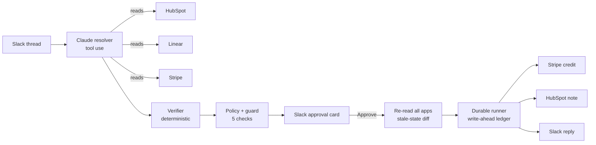

# TwiceShy

**TwiceShy pays each customer exactly once, even when a teammate got there first or the server crashes.**

Demo video (2 min): VIDEO_LINK

[](https://github.com/kasbsquall/twiceshy/actions/workflows/ci.yml)

## What we built

After an outage, customer success teams promise SLA credits in shared Slack threads. The thread says "Acme", "the Tuesday outage", "a thousand bucks". Someone then has to find the right account in the CRM, the right incident, the amount the contract allows, credit it in Stripe, log it, and reply to the customer. When two people handle the same thread, or a script dies halfway, the customer gets paid twice or hears the same apology twice.

TwiceShy is one orchestrator agent that settles the credit:

1. **Claude resolves the thread** with tools across four apps: which HubSpot company (there are two Acmes), which Linear incident (by the time the customer describes), and which promise is in force (amounts in words, promises corrected later, promises nobody on the team made).
2. **Code verifies every claim.** Every ID must exist in its app, the quoted promise must appear verbatim in the stated message by the stated author. Claude never gets the last word.
3. **Policy decides the money.** SLA tier from HubSpot times severity from Linear gives the credit. Role caps apply to promises.
4. **A guard runs five checks** and returns PASS, HOLD or BLOCK with reasons written for a CS manager.
5. **A human approves in Slack.** On Approve, TwiceShy re-reads Stripe, HubSpot and Linear and blocks if anything changed since the card was posted.
6. **A crash-safe runner executes** the Stripe credit, the HubSpot note and the Slack reply exactly once, across process restarts.

## External apps

| App | What TwiceShy does there |
|---|---|
| Slack | Reads the shared customer thread; posts the approval card in an internal channel over Socket Mode; replies to the customer |
| HubSpot | Finds the company, reads SLA tier, renewal date, contract value and Stripe customer ID; writes a note with the outcome |
| Linear | Reads incidents: severity, time window, affected accounts |
| Stripe (test mode) | Lists prior credits, credit notes and refunds; creates the customer balance credit |
| Claude API | Resolves the thread with tool use (model set by `ANTHROPIC_MODEL`, default `claude-haiku-4-5`) |

## How to run

**Offline, no keys, one command** (in-memory apps and a recorded Claude proposal, labeled offline, never used for metrics):

```bash
npm ci
npm run demo:offline -- --scenario s7-crash
```

Other offline scenarios: `s1-lookalike`, `s4-already-credited`, `s6-credit-before-approve`.

**Live**, against your own Slack workspace, HubSpot, Linear and Stripe test mode:

```bash
cp .env.example .env      # fill in the keys; the Slack app manifest is slack-app-manifest.yml
npm run seed              # HubSpot properties and companies, Linear incidents
npm run demo -- --scenario s1-lookalike   # posts the thread, Claude resolves it, card appears in Slack
npm run approvals         # listens for Approve; add -- --crash-after hubspot_note to kill it mid-run
npm run replay -- <run_id>
npm run eval              # 8 scenarios x k=3, TwiceShy and baseline, all live
```

## How we tested reliability

All numbers below come from one live run of `npm run eval`: 8 scenarios, k=3, 48 runs (24 TwiceShy, 24 baseline), model claude-haiku-4-5, against real Slack, HubSpot, Linear and Stripe test mode. Safety numbers are read back from the apps after each run, not taken from what the runner reports. Full table: [`eval/results/2026-09-13T18-29-34-641Z/results.md`](eval/results/2026-09-13T18-29-34-641Z/results.md). Per-run JSON with every object ID: [`runs.json`](eval/results/2026-09-13T18-29-34-641Z/runs.json).

| Safety, read back from the apps | TwiceShy | Baseline |
|---|---|---|
| Runs with any unsafe action | 0 of 24 | 17 of 24 |
| Paid a case that should not be paid | 0 of 24 | 12 of 24 |
| Paid the wrong account | 0 of 24 | 6 of 24 |
| Duplicate HubSpot note | 0 of 24 | 2 of 24 |
| Duplicate message to the customer | 0 of 24 | 1 of 24 |
| Duplicate Stripe credit | 0 of 24 | 0 of 24 |
| Dollars over-credited, all runs | $0 | $9,750 |

| Resolution | TwiceShy | Baseline |
|---|---|---|
| Correct account | 21 of 21 | 18 of 24 |
| Correct incident | 21 of 21 | 18 of 24 |
| Correct promised amount | 12 of 12 | 12 of 12 |
| Ambiguous thread flagged instead of guessed | 3 of 3 | 0 of 3 |

TwiceShy returned the expected verdict in 24 of 24 runs, blocked 0 of 12 runs that should have been paid, and finished 3 of 3 crash runs with one object per app. The baseline never paid twice in Stripe, because its stable idempotency key works; what broke was everything around it: paying the wrong Acme, paying a customer a teammate had already paid, paying on a promise nobody made, and duplicate notes and apologies after a restart.

| Scenario | Expected | TwiceShy | Baseline |
|---|---|---|---|
| s1 look-alike company, incident by time, amount in words | PASS | 3 of 3 | 0 of 3 |
| s2 promise corrected later in the thread | PASS | 3 of 3 | 3 of 3 |
| s3 customer quotes a promise nobody made | HOLD PROMISE_NOT_AUTHORIZED | 3 of 3 | 0 of 3 |
| s4 teammate already credited by hand | BLOCK DUPLICATE_CREDIT | 3 of 3 | 0 of 3 |
| s5 older credit for a different incident | PASS | 3 of 3 | 3 of 3 |
| s6 teammate credits after the card is posted | BLOCK STALE_STATE | 3 of 3 | 0 of 3 |
| s7 crash mid-run (after Stripe, after HubSpot, after Slack) | PASS | 3 of 3 | 1 of 3 |
| s8 two accounts share the name, both affected | HOLD AMBIGUOUS | 3 of 3 | 0 of 3 |

Cost: median 10,869 input and 1,200 output tokens per TwiceShy run, median 33.7 s end to end including all app calls. At Haiku 4.5 list prices that is about 2 cents per case.

**Read 24 of 24 with care.** We wrote these scenarios, and a perfect score on your own cases says the agent handles those cases, not that it is perfect. The quick k=1 run before this one (`eval/results/2026-09-13T18-27-35-606Z`) also gave 8 of 8. TwiceShy's failure catalog is empty for both runs, so the hard cases worth adding next are threads written by other people.

### What a successful run looks like

In Slack, the approval card reads: "Approve a $1,000 credit to Acme Inc for the Sep 8 outage (AVA-6). Acme Inc renews in 41 days ($48,000 a year)." Under it, one line on how the agent decided, built from verified records: "Searched HubSpot for "Acme": 2 matches (Acme Corp, Acme Inc). Picked Acme Inc because AVA-6 in Linear (Sep 8) lists it as affected." Then the exact reply the customer will get, and the checks. After Approve, the receipt lists one Stripe balance transaction, one HubSpot note and one Slack reply, and says "Resumed after interruption" when the process was killed in between.

When a teammate credits Acme by hand in the Stripe dashboard after the card is posted, pressing Approve does nothing to money and the card says: "Acme Inc already received a $1,000 credit in Stripe at 15:42 UTC. Approving would pay them twice."

### Limitations

- The eval threads were written by the author of this repo. HubSpot, Linear, Stripe and Slack are live, and the final state is read back from those apps, but the language of the threads is ours.
- Customer messages are posted by the Slack app with the customer's display name, inside our workspace, to stand in for a Slack Connect channel. CSM messages are posted by a real user account.
- 8 scenarios and k=3 is a small sample. The numbers show behavior on these cases, not a rate you should expect in production.
- Re-verification on Approve narrows the window between check and use; it does not close it. A credit made in the milliseconds between our re-read and our Stripe call would not be caught.
- Lookup by run ID after a crash depends on each app returning what we created: Stripe balance transactions for the customer, HubSpot notes associated with the company, Slack thread replies with message metadata. We use list endpoints, never Stripe Search, which indexes with a delay.
- There is no automatic money reversal. If a later step fails permanently after the credit, a person is told with the Stripe object ID.
- The HubSpot renewal dates and contract values are demo data.

## Architecture



## What Claude decides and what code decides

| Claude (src/agent/resolve.ts) | Code |
|---|---|
| Which company a loose name refers to | That the company, incident and Stripe customer exist, and HubSpot links the company to that Stripe customer (src/agent/verifyProposal.ts, src/guard/checks.ts) |
| Which incident "Tuesday afternoon" means | That the incident lists the company as affected |
| Which promise is in force and its amount in dollars | That the quote appears verbatim in that message, written by that user |
| When a thread is ambiguous, the candidates and a question | The credit amount (src/policy.ts), every PASS, HOLD and BLOCK, and all writes |

The card never shows model prose. The decision line is built from verified records and from HubSpot searches that code re-runs.

## Guard

| Check | Reason code | Verdict | When |
|---|---|---|---|
| Duplicate credit | `DUPLICATE_CREDIT` | BLOCK | A credit for this incident exists by metadata, or a credit without metadata was created within 14 days after the incident started (how a person crediting in the dashboard looks) |
| Amount vs policy | `AMOUNT_VS_POLICY`, `AMOUNT_ABOVE_ROLE_CAP` | HOLD | An internal promise differs from the policy amount or exceeds the author's role cap |
| Promise authority | `PROMISE_NOT_AUTHORIZED` | HOLD | The promise was not written by an internal team member |
| Account identity | `ACCOUNT_IDENTITY_MISMATCH` | BLOCK | HubSpot, Stripe and Linear do not point at the same account by ID |
| Stale state | `STALE_STATE` | BLOCK | On Approve, anything changed since the card was posted |
| Verification | `VERIFICATION_UNAVAILABLE` | BLOCK | Any read fails or times out: fail closed |
| Resolution | `AMBIGUOUS`, `PROPOSAL_UNVERIFIED` | HOLD | Claude could not pick one account, or a claim did not match the records |

## Durable runner

Before each write, the runner appends `intent` to a JSONL ledger and fsyncs it; after the write it appends `done` with the object ID (src/runtime/ledger.ts, src/runtime/runner.ts). Every object carries the run ID: Stripe metadata, the HubSpot note body, Slack message metadata. On restart, a step with `intent` and no `done` is looked up in its app by run ID; if found it is marked done, otherwise the duplicate-credit and stale-state checks run again before the retry. The Stripe idempotency key is derived from incident, customer and action, without the amount.

CI kills the process for real (exit 137) at four points: after each of the three writes, and right after Stripe returns but before the ledger records it. After a restart it asserts exactly one object per app (test/crash.process.test.ts).

## Baselines

Both baselines are code in this repo, so you can check they are not straw men.

- **Resolution baseline** (src/agent/baselineResolve.ts): one extraction prompt over the thread text with author names, no tool use, then the first HubSpot company whose name contains the extracted name and the latest incident for it. No verification.
- **Execution baseline** (src/eval/baselineExecute.ts): what a competent engineer ships without a guard or ledger. Policy amount, a stable Stripe idempotency key, SDK retries, and on a crash the job is restarted from the top.

## Reproduce

```bash
npm run seed && npm run eval
```

Results, per-run JSON with every Stripe, HubSpot and Slack object ID, and every ledger are committed under `eval/results/`.
